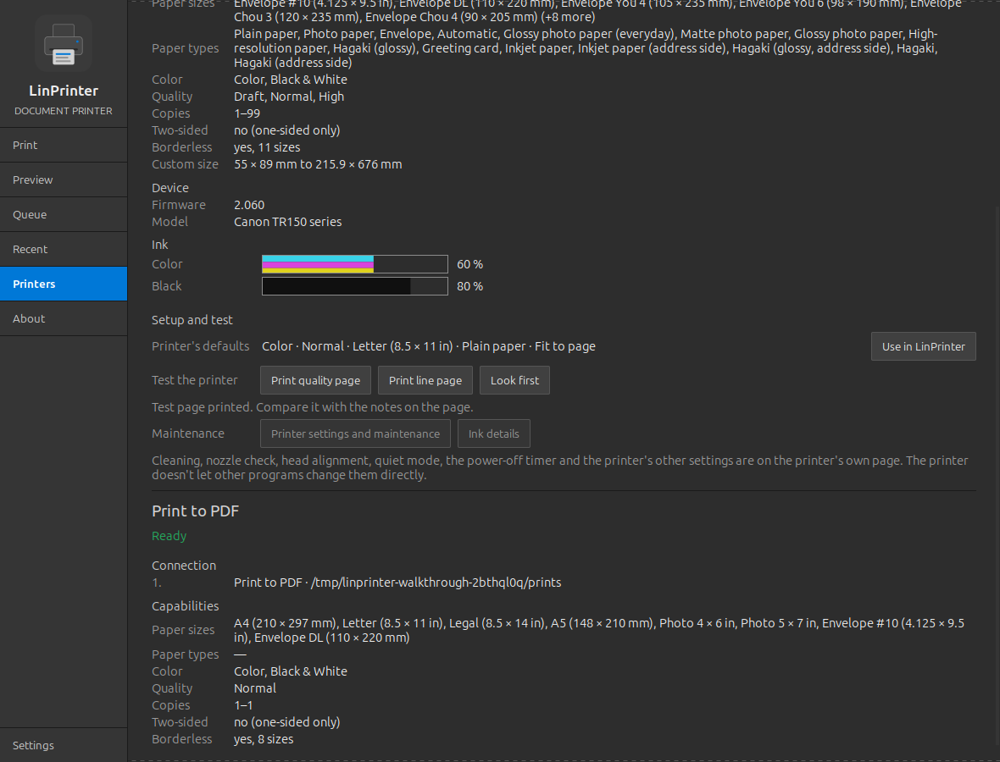
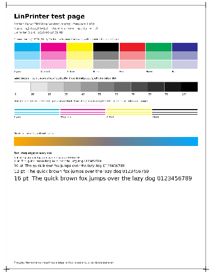
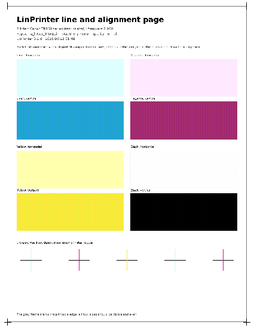

# LinPrinter

A document printer for Linux. Print PDFs, images and text on your USB
printer, and see beforehand exactly what will print. You can also check ink,
test the printer, set it up, or print to PDF. It's a sibling of
[LinScanner](https://github.com/MensuraMedia/linscanner), built the same
way: the same interface, the same switchable feature modules, and the same
USB-only privacy.


| | |
|---|---|
| Version | 0.2.0 (see [changelog.md](changelog.md)) |
| Verified printer | Canon TR150 series (USB, driverless) |
| Platform | Linux desktop, GTK 3, Python 3.10+ |
| Connection | **USB cable only.** Wi-Fi and network printing are not supported at this time. |
| Licence | [LinPrinter Community License (Noncommercial) 1.0](LICENSE): free to use, copy, modify and share; commercial use needs our written permission |

## Contents

1. [Features](#1-features)
2. [Compatibility](#2-compatibility)
3. [Installation](#3-installation)
4. [Using LinPrinter](#4-using-linprinter)
5. [Setting up and testing your printer](#5-setting-up-and-testing-your-printer)
6. [Settings, files and command line](#6-settings-files-and-command-line)
7. [Troubleshooting](#7-troubleshooting)
8. [Safety, security and privacy](#8-safety-security-and-privacy)
9. [Known limits and roadmap](#9-known-limits-and-roadmap)
10. [Development](#10-development)
11. [Credits](#11-credits)
12. [License](#12-license)

## 1. Features

- **Detect Printer**: Find, the printer list, and a power mark. The mark is
  green when the printer is ready, amber when it needs attention (low ink,
  for example) and red when it is off or stopped, with a plain message such
  as "Printer may be off. Check power settings." or "Load paper in the rear
  tray." LinPrinter remembers the printer, so the next start reaches it
  straight away.
- **Documents**: PDF, PNG, JPEG, TIFF (multi-page), BMP, GIF and plain text.
  Open one with Open… or drop it on the Print page.
- **Print Options, only the ones your printer really has**:
  - copies;
  - Color or Black & White;
  - Draft, Normal or High quality;
  - pages: All, a range such as `1-3, 5`, Odd, Even or Current;
  - paper size, grouped (documents, photos, envelopes, cards, custom);
  - paper type (plain, photo, glossy, matte, envelopes, Hagaki and so on);
  - borderless, where the printer allows it for that size and type;
  - Fit to page or Actual size.

  Anything the printer can't do isn't offered.
- **Preview**: the pages exactly as they will print, with your paper, the
  printer's margins shaded, colour or grey, and landscape pages turned. It
  has zoom, page navigation and 1- or 2-row thumbnails. Clicking a thumbnail
  sets the page used by Pages → Current.
- **Queue**: waiting, printing and finished jobs, with pages done, the time
  sent and how each job was sent. Cancel a waiting or printing job.
- **Recent**: documents you have printed, newest first. Open the folder,
  print a document again, or clear the list (all, or entries older than
  5 / 10 / 20 / 30 days).
- **Printers Found**:
  - every printer and how LinPrinter reaches it, best way first;
  - USB details and capabilities;
  - firmware;
  - ink levels drawn in the cartridges' own colours;
  - Identify (the printer flashes);
  - **Setup and test**; see [section 5](#5-setting-up-and-testing-your-printer).
- **Print to PDF**: saves to `~/Documents/prints` (you can change the folder
  in Settings), with the same paper sizes and preview. No printer needed.
- **Feature modules** (Settings → Features; each can be switched off or
  deleted):
  - **Ink alerts** warns before printing when a cartridge is low (you set
    the level). On by default.
  - **Print profiles** adds one-click presets: Everyday, Draft, B&W document,
    Best quality, Photo 4×6 borderless and Envelope #10. You can also save
    your own. Off by default.
- **Reliable printing**: LinPrinter talks to the printer directly (IPP
  Everywhere over USB, through ipp-usb), and uses the CUPS queue if that
  fails. It checks the job with the printer first (Validate-Job). It doesn't
  retry another way when *you* need to act (paper out, jam, cover open, ink
  empty); it tells you what to do instead.
- **Themes**, a resizable window that snaps to screen halves and quarters,
  and the app icon in the panel and Alt+Tab.

| Preview | Printers Found |
|---|---|
|  |  |

## 2. Compatibility

LinPrinter is ever evolving: each release adds and verifies more printers
and systems.

| | |
|---|---|
| Printers | USB printers that print driverless (IPP Everywhere / AirPrint over IPP-USB). That covers most inkjet and laser printers since about 2015 from Canon, Epson, HP, Brother, Samsung, Xerox and others. |
| Older printers | Any USB printer with a working CUPS queue (Gutenprint, HPLIP, vendor drivers) |
| Verified | Canon TR150 series (USB, driverless) |
| Systems | Linux Mint 22 (tested). Ubuntu 24.04 and other Debian-based systems with Python 3.10+, GTK 3, CUPS and Ghostscript. |
| Not yet | Wi-Fi / network printers, automatic two-sided printing, N-up and booklets |

To check a printer, open **Printers**: it shows whether LinPrinter can reach
the printer, and how.

**Requirements** (all distro packages, no pip): python3, python3-gi,
python3-gi-cairo, gir1.2-gtk-3.0, python3-pil, cups, cups-client,
cups-filters, cups-ipp-utils, ipp-usb, ghostscript, fontconfig,
fonts-dejavu-core, librsvg2-common.

## 3. Installation

### Recommended (as your normal user, not sudo)

```bash
git clone https://github.com/MensuraMedia/linprinter.git
cd linprinter
bash install.sh
```

The installer:
- adds any missing packages, asking for sudo only then;
- adds LinPrinter to the menu, with its icon;
- checks that the app starts, CUPS is running, ipp-usb is present and the
  printer can be found.

It is safe to run again: it only changes what is missing or wrong.

### Offline machine

LinPrinter is also the `linprinter/` submodule of MensuraMedia's
linux-peripherals collection, which carries an offline package pool. When
LinPrinter is checked out there, `install.sh` installs the packages from
that pool first, with no internet needed (`bin/offline-install`).

### Manual

```bash
sudo apt install python3-gi python3-gi-cairo gir1.2-gtk-3.0 python3-pil cups cups-filters cups-ipp-utils ipp-usb ghostscript fonts-dejavu-core librsvg2-common
./run.sh
```

### Uninstall

```bash
bash install.sh --uninstall   # removes the menu entry and icon; settings stay
```

## 4. Using LinPrinter

1. Plug the printer in with its USB cable and switch it on. On the
   **Print** page, the power mark turns green and the printer is chosen for
   you. If the mark is red, check the cable and power, then press **Find**.
2. **Open…** a document, or drop one on the page.
3. Choose the options. The line under them says what will print, for
   example "1 copy · Black & White · Normal · A4 · Plain paper · Fit to page
   · 3 page(s)".
4. Press **Preview** to see the pages, or **Print**. The progress bar and
   the status line follow the job, and the **Queue** shows it too.
5. To print a document again, find it in **Recent** and click its document
   icon.

**Print to PDF** is in the printer list. The file is saved as
`<name>-<date-time>.pdf` in `~/Documents/prints`.

## 5. Setting up and testing your printer

Open **Printers**. Each printer has a **Setup and test** section:

- **Printer's defaults**: the colour, quality, paper size, paper type and
  fitting the printer itself uses. **Use in LinPrinter** makes them the
  Print page's starting choices; you can still change them for each job.
- **Test the printer**:
  - **Print quality page** has colour blocks at 100 / 50 / 25 %, grey steps,
    fine lines for each ink, a gradient, text from 6 to 16 pt, and a frame
    at the printable edge. It shows streaks, gaps (blocked nozzles), colour
    casts, banding, and whether the margins are right.
  - **Print line page** has striped fields for each ink and alignment
    crosses, and shows missing nozzles and misalignment.
  - **Look first** puts the quality page on the Print page, so you can
    preview it or change the paper first.

  Each page asks before printing and uses one sheet of plain paper. Test
  pages aren't added to Recent.
- **Maintenance**: **Printer settings and maintenance** and **Ink details**
  open the printer's own pages. ipp-usb serves them on this computer over
  the USB cable, so nothing goes on the network. That is where you'll find
  cleaning, nozzle check, head alignment, quiet mode, the power-off timer and
  the printer's other settings. The TR150 (like most printers) doesn't let
  other programs change those settings directly.
- **Identify** makes the printer flash, and the **Ink** gauges show each
  cartridge.



| Quality page | Line page |
|---|---|
|  |  |

## 6. Settings, files and command line

**Settings**:
- theme;
- Print to PDF folder;
- the low-ink warning level;
- network printing (shown as *Not Supported*);
- feature modules;
- diagnostics: open the log folder, or save a diagnostics zip on this
  computer.

| What | Where |
|---|---|
| Settings | `~/.config/linprinter/settings.json` |
| Print to PDF | `~/Documents/prints` (changeable) |
| Recent list | `~/.local/share/linprinter/recent.json` |
| Logs (14 days, redacted) | `~/.local/state/linprinter/logs/` |
| Jobs being prepared | `/tmp/linprinter-*/`, deleted when LinPrinter closes |

```text
./run.sh                    start LinPrinter
./run.sh --test-printer     built-in test printer + Print to PDF only (no hardware, nothing printed)
./run.sh --page printers    open on a page: print, preview, queue, recent, printers, settings, about
./run.sh --list-printers    list the printers LinPrinter can reach, then exit
./run.sh --debug            verbose log, also in the terminal
./run.sh --version
```

## 7. Troubleshooting

| You see | Try |
|---|---|
| Red power mark, "Printer may be off. Check power settings." | Switch the printer on, check the USB cable, press **Find**. `systemctl status ipp-usb` should show it running while the printer is plugged in. |
| "Load paper in the rear tray." | Load paper and print again. LinPrinter won't send the job another way while the printer needs you. |
| "The printer stopped the job." | Check the printer's display or lights (jam, cover, ink), then print again. |
| Streaks or faded colours | Print the **quality page** (Printers → Setup and test). If lines are broken, run cleaning from **Printer settings and maintenance**. |
| Only "Print to PDF" is listed | `./run.sh --list-printers`. Check `lsusb` shows the printer, and that `cups` and `ipp-usb` are installed (`bash install.sh`). |
| Something else | Settings → Diagnostics → **Save diagnostics…**, then look at the zip or send it to whoever helps you. It stays on your computer until you share it. |

## 8. Safety, security and privacy

**Our commitment:** everything happens on this computer. LinPrinter never
sends your documents or any other information to anyone. There is no cloud,
no account, no telemetry and no update check.

- **Where your documents go:** only down the USB cable to your printer, or
  into your Print to PDF folder. Temporary job files are deleted when
  LinPrinter closes.
- **No network:** LinPrinter does not search the network for printers and
  ignores network print queues (`NETWORK_PRINTING = False`). It talks to
  ipp-usb only on `127.0.0.1`. The printer's own pages it opens are on
  `localhost` too, served over USB.
- **Logs** are redacted: serial numbers, device IDs and your home folder
  path are removed. Diagnostics are saved only where you choose.
- **Security:** no network services are started. The installer uses only
  your distribution's packages (or the linux-peripherals offline pool),
  never `curl | bash`.

## 9. Known limits and roadmap

- USB only; Wi-Fi / network printing is not supported yet.
- The TR150 prints one-sided only and doesn't report page ranges, so
  LinPrinter selects the pages itself before sending.
- Fill-page scaling, N-up, booklets, manual two-sided and a custom paper size
  dialog are planned (see [docs/CONCEPT.md](docs/CONCEPT.md) §13).
- Printer-side settings (cleaning, alignment, quiet mode) are changed on the
  printer's own page; the printer doesn't allow changing them over IPP.

## 10. Development

```bash
python3 -m compileall -q src                              # build
python3 -m black --check src tests tools && python3 -m pyflakes src tests tools   # lint
python3 -m pytest -q                                      # test (uses the built-in test printer)
python3 tools/walkthrough.py                              # scripted UI run + screenshots
python3 tools/gen_api_docs.py                             # docs/api-reference.md
```

- The **test printer** (`src/backends/test_printer.py`) is a small IPP
  server on `127.0.0.1` that answers with the real TR150's attributes
  (`resources/test-printer/tr150-attributes.json`, identifiers removed).
  CUPS' `ipptool get-printer-attributes.test` passes against it. Tests and
  the walkthrough never print on real hardware.
- Architecture: [docs/architecture.md](docs/architecture.md) · technical
  reference: [docs/TECHNICAL.md](docs/TECHNICAL.md) · features:
  [docs/FEATURES.md](docs/FEATURES.md) · design notes:
  [docs/design/](docs/design/) · API: [docs/api-reference.md](docs/api-reference.md)
- Contributor rules: [CLAUDE.md](CLAUDE.md).

## 11. Credits

- Interface: gtk-python-dashboard-starter by mikesdatawork.
- Build process: MensuraMedia universal-instruction-set.
- Printing: CUPS and cups-filters (OpenPrinting), ipp-usb (OpenPrinting),
  IPP Everywhere (PWG).
- Rendering: Ghostscript (Artifex) and Pillow.
- Icons: [Phosphor Icons](https://phosphoricons.com) by Helena Zhang and
  Tobias Fried (MIT, see `resources/icons/phosphor/LICENSE`).

## 12. License

LinPrinter Community License (Noncommercial) 1.0. You're welcome to use it
free of charge, and to copy, modify and share it for any noncommercial
purpose. Commercial use needs written permission from MensuraMedia; we're
happy to talk. The components LinPrinter builds on keep their own licences.
See [LICENSE](LICENSE).
